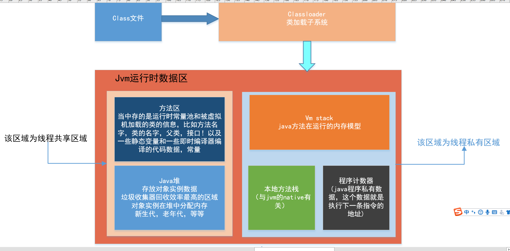
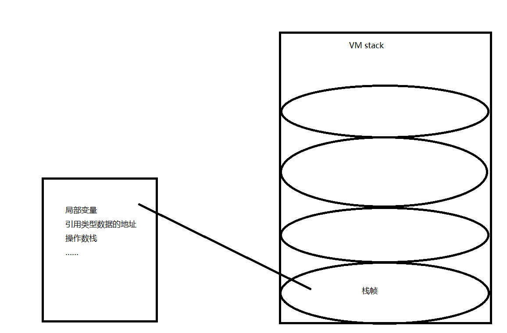
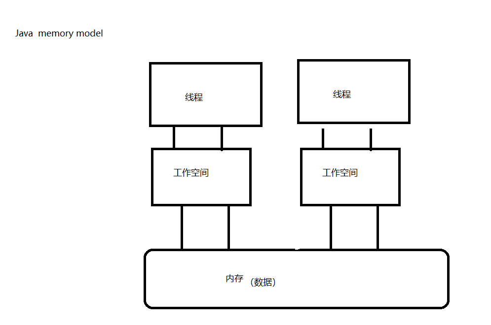
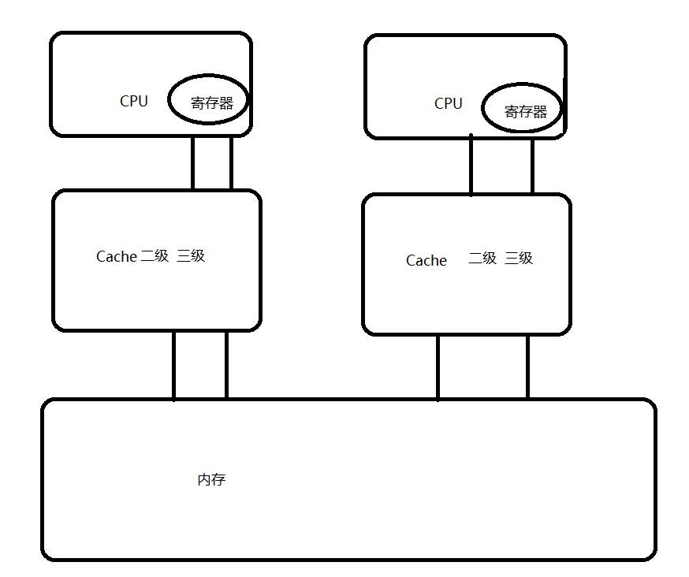
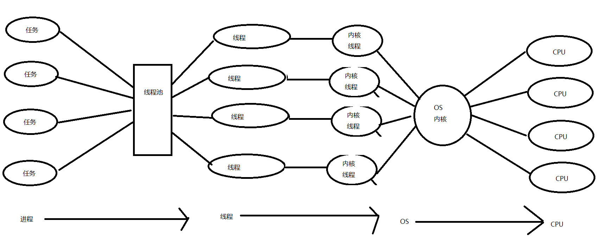

#                            java 内存模型

1. ### jvm内存区域

方法区：类信息、常量、static 、JIT    （信息共享）

Java堆区：实例对象     GC   （信息共享）   (OOM)

VM stack：Java方法在运行的内存模型   (OOM)	

PC：java线程的私有数据，这个数据就是执行下一条指令的地址

  Native method stack:  与JVM的native 

2. #### Java内存模型   Java memory model   JMM(规范,抽象的模型) 

   

1）主内存：共享的信息

2）工作内存：私有信息，基本数据类型，直接分配到工作内存，引用的地址存放在工作内存，引用的对象存放在堆中

3）工作方式：

​         A  线程修改私有数据，直接在工作空间修改

​         B  线程修改共享数据，把数据复制到工作空间中去，在工作空间中修改，修改完成以后，刷新内存中的数据 

### 5.硬件内存架构与java内存模型

​	1)1) 硬件架构

a) CPU缓存的一致性问题：并发处理的不同步

b) 解决方案：

​      i. 总线加锁（）  降低CPU的吞吐量

​      ii. 缓存上的一致性协议（MESI）

   （当CPU写数据时，如果发现操作的变量是共享变量，即在其他CPU中也存在该变量的副本，会发出信号通知其       他CPU将该变量的缓存行置为无效状态，因此当其他CPU需要读取这个变量时，发现自己缓存中缓存该变量的缓存行是无效的，那么它就会从内存重新读取。）

2) Java线程与硬件处理器

1) Java内存模型的必要性

​     Java内存模型的作用：规范内存数据和工作空间数据的交互

##### 5、并发编程的三个重要特性

原子性：不可分割  x=1

可见性：线程只能操作自己工作空间中的数据

有序性：程序中的顺序不一定就是执行的顺序

​     编译重排序

​     指令重排序

​       提高效率

#### 6、JMM对三个特征的保证

1）JMM与原子性（是指一个操作是不可中断的。即使是多个线程一起执行的时候，一个操作一旦开始，就不会被其他线程干扰。）

A) X=10  写  原子性   如果是私有数据具有原子性，如果是共享数据没原子性（读写）  

B) Y=x  没有原子性

a)  把数据X读到工作空间（原子性）

b)  把X的值写到Y（原子性）

C) I++ 没有原子性

a) 读i到工作空间

b) +1；

c) 刷新结果到内存

D) Z=z+1 没有原子性

a) 读z到工作空间

b) +1；

c) 刷新结果到内存

多个原子性的操作合并到一起没有原子性

保证方式：

Synchronized

JUC   Lock的lock

 

2）JMM与可见性

​     Volatile:在JMM模型上实现MESI协议

​     Synchronized:加锁

JUC   JUC   Lock的lock

3）JMM与有序性  

  Volatile：

  Synchronized：

Happens-before原则：

1）程序次序原则

2）锁定原则  ：后一次加锁必须等前一次解锁

3）Volatile原则：霸道原则

4）传递原则：A---B ---C    A--C

